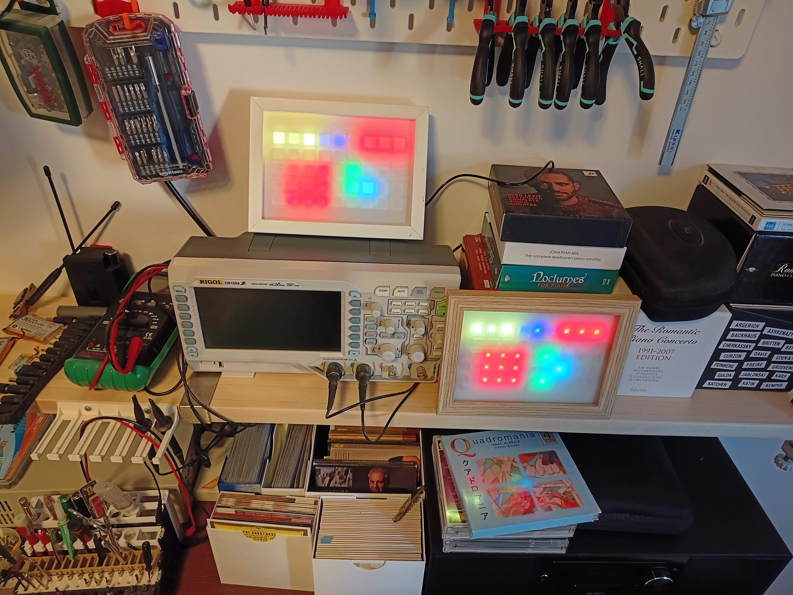
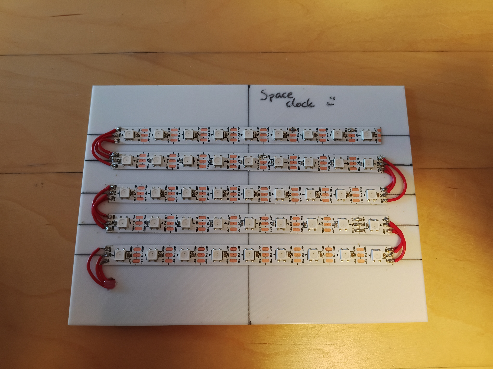
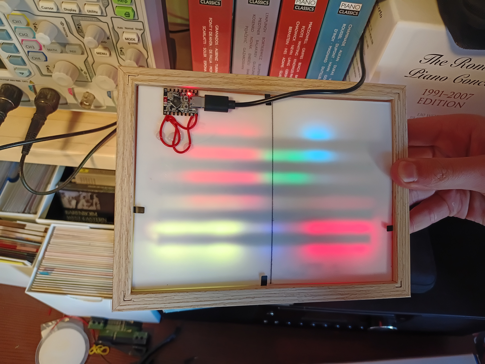

Space clock project readme:
  - requirements:
    - Esp32 c3
    - Type C cabel
    - Laptop or pc
    - 45 LED long Neopixel strip
      - Important : 14.5 mm between each LED
    - 3d printer to print the shell

What is a Space clock:
    - Space clock = Space ( hacker space ) clock
    - 
!! Not a binary clock !!
How to read the time of a space clock:
    - The first colour group from the left displays the hours first digit.
    - The second colour group from the left displays the hours second digit.
    - The third colour group displays the minutes first digit
    - And the last one, you guessed it, the minutes second digit
What is the code structure behind the Space clock:
    - One class Space clock that handles the RTC, WiFi, and RGB manadgement.
    - A "config.json" file that includes user specs like WiFi password, brightness and time zone
How do I make a space clock for my self?
    - solder the neopixel strip as shown bellow:
    - 
    - next glue the esp on the back 
